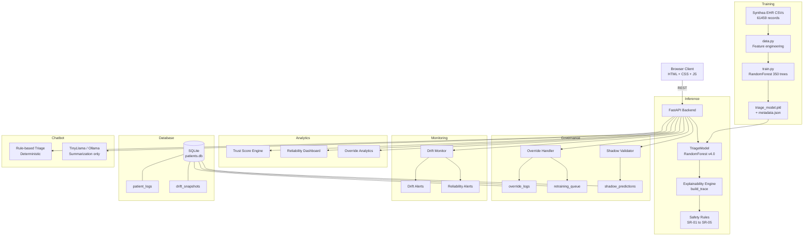
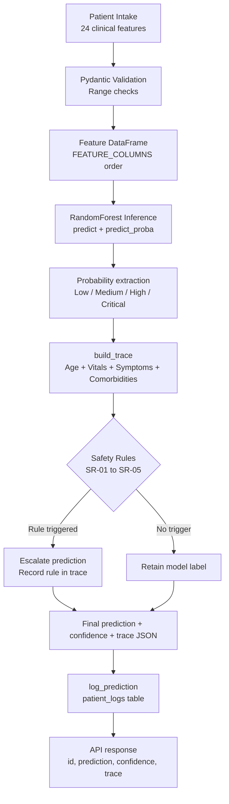
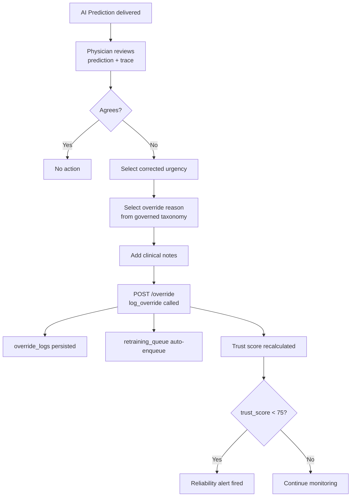
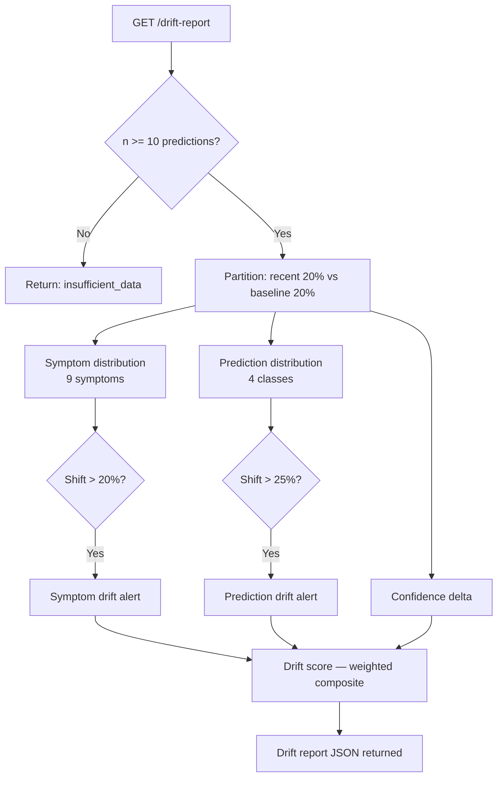
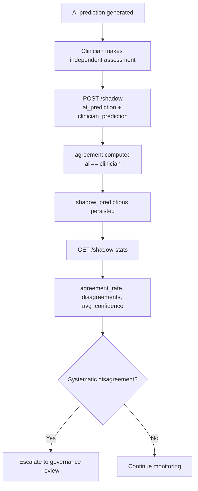
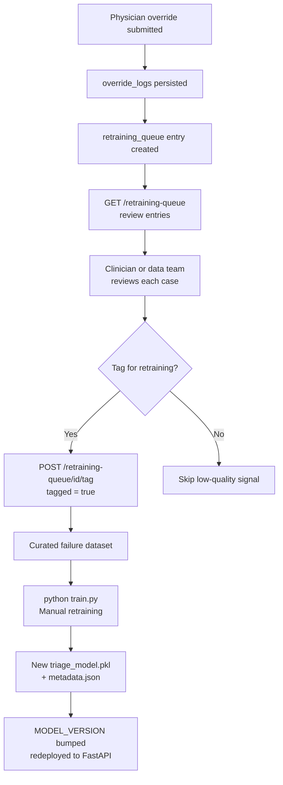

<div align="center">

# TriageFlow AI

### Clinical AI Reliability & Governance Platform

**A prototype governance infrastructure layer for trustworthy healthcare AI automation**

---


---

> TriageFlow AI is a working prototype that addresses the governance and reliability gap in healthcare AI systems — not by improving prediction accuracy, but by building the infrastructure that makes AI predictions accountable, explainable, and correctable.

---

[](#demo)
[]()

</div>

---

## Table of Contents

- [Problem Statement](#problem-statement)
- [Why Governance Matters](#why-governance-matters)
- [Concrete Scenario](#concrete-scenario)
- [Features](#features)
- [System Architecture](#system-architecture)
- [Workflow Diagrams](#workflow-diagrams)
- [Tech Stack](#tech-stack)
- [Dataset](#dataset)
- [Model](#model)
- [API Reference](#api-reference)
- [Installation](#installation)
- [Screenshots](#screenshots)
- [Demo](#demo)
- [Current Limitations](#current-limitations)
- [Roadmap](#roadmap)
- [For Recruiters & Founders](#for-recruiters--founders)
- [Disclaimer](#disclaimer)

---

## Problem Statement

Healthcare organizations are deploying AI into patient-facing workflows — triage, intake, clinical routing, automated assistants — at an accelerating pace. The models generally work. The surrounding infrastructure often does not.

Most healthcare AI projects focus on one question: **can the model predict accurately?**

They underinvest in the equally important questions that arise the moment a model is deployed:

- When the model is wrong, how is that detected?
- Who can correct it, and is that correction recorded with context?
- How do we know if model behavior is shifting over time?
- What does the model's decision actually mean, step by step?
- How do clinician corrections feed back into retraining?
- Can we quantify whether the system is trustworthy right now?

Without infrastructure to answer these questions, a prediction engine — however accurate — is difficult to govern responsibly. TriageFlow AI is a prototype that builds this layer alongside a working clinical triage model.

---

## Why Governance Matters

A healthcare AI system without governance infrastructure has a predictable failure profile:

**Silent errors** — the model misclassifies a case; no mechanism surfaces it before it affects care routing.

**No accountability chain** — when a clinician disagrees with a prediction, there is no structured way to record that disagreement, so it disappears.

**Undetected drift** — patient population or symptom distribution shifts over months; model performance degrades, but no alert fires.

**No feedback loop** — override data accumulates as tacit clinical knowledge, never reaching the training pipeline.

**Unquantifiable trust** — leadership cannot answer "how reliable is this system right now?" with a number backed by data.

These are not hypothetical risks. They are the documented failure modes of ML systems operating without observability and governance. TriageFlow AI treats these as engineering problems with engineering solutions.

---

## Concrete Scenario

> A 67-year-old patient presents with chest tightness, mild shortness of breath, and a history of hypertension. The AI triage system classifies urgency as **Medium**. A physician reviews the case and assesses it as a potential acute coronary event. The appropriate classification is **Critical**.

In a system without governance infrastructure:

- The override is communicated verbally and is not recorded
- No one knows the model's confidence was 0.61 — a borderline case
- This pattern of chest pain misclassification is not aggregated or detected
- The case does not feed back into retraining

In TriageFlow AI:

| Event | What happens |
|---|---|
| Physician overrides to Critical | Recorded with clinician ID, reason taxonomy, clinical notes, timestamp |
| Override reason | "Severity Mismatch" — persisted to override_logs |
| Model confidence | 0.61 — visible in the explainability trace as borderline |
| Pattern detection | Rising chest-pain override rate surfaces in governance analytics |
| Retraining | Case auto-queued to retraining_queue with quality score |
| Trust score | Recalculated — penalized when high-confidence predictions are overridden |
| Audit trail | Input → prediction → trace → override → reason — all persisted |

The goal is not to make the model perfect. The goal is to make the system's failures visible, attributable, and correctable.

---

## Features

### 1. Expanded Clinical Intake — 24 Structured Inputs

Every prediction is built on a validated 24-feature clinical intake:

**Demographics:** age, sex
**Vitals:** temperature, heart rate, respiratory rate, SpO2, systolic BP, diastolic BP, pain score
**Symptoms:** fever, chest pain, breathing difficulty, headache, fatigue, vomiting, bleeding, seizure, confusion, abdominal pain, weakness
**Comorbidities:** diabetes, hypertension, asthma/COPD, heart disease

All inputs are validated through Pydantic schemas with clinical range constraints (e.g., SpO2 50–100, heart rate 20–240, age 0–110).

---

### 2. AI Clinical Triage Prediction

The RandomForest model outputs a four-class urgency classification — **Low / Medium / High / Critical** — along with class probabilities and a confidence score (maximum class probability). Every prediction is persisted to `patient_logs` with the full 24-feature snapshot and model version identifier.

---

### 3. Explainable AI — Deterministic Decision Trace

Every prediction generates a stepwise, deterministic audit trace stored as structured JSON. This is not post-hoc approximation — it is a real-time record of how the classification was computed.

**Pipeline steps:**

```
age_risk → vital_scoring → symptom_scoring → comorbidity_scoring
         → model_inference → safety_rules → final_decision
```

Each step records input values, thresholds, contribution scores, and triggered safety rules. The frontend renders this as an expandable trace viewer.

**Five clinical safety rules** operate post-model and can escalate the prediction independently of what the classifier outputs:

| Rule | Condition | Effect |
|---|---|---|
| SR-01 | SpO2 < 90 OR seizure OR confusion | Escalate to minimum Critical |
| SR-02 | Chest pain AND (heart disease OR breathing difficulty) | Escalate to minimum High |
| SR-03 | Systolic BP < 90 OR > 180 | Escalate to minimum High |
| SR-04 | Age > 70 AND fever | Escalate to minimum Medium |
| SR-05 | Bleeding OR respiratory rate > 28 | Escalate to minimum High |

When a rule fires and changes the prediction, this is explicitly recorded in the trace with rule ID, condition, and action taken.

---

### 4. Human-in-the-Loop Physician Override

Clinicians can review any prediction and submit a structured override:

- **Corrected urgency** (Low / Medium / High / Critical)
- **Override reason** from a governed taxonomy: False Positive, False Negative, Missing Context, Chronic Condition, Temporary Symptoms, Severity Mismatch, Model Overconfidence, Other
- **Clinical notes** (free text)
- **Clinician ID** for attribution

Every override is persisted to `override_logs` and automatically enqueued to the retraining queue. Override direction — escalation (model under-predicted) vs. de-escalation (model over-predicted) — is tracked to detect systematic directional bias.

---

### 5. Governance Analytics & Trust Score

The trust score is a continuously computed metric:

```
trust_score = 100
            − override_penalty      (up to 35 pts, scales with override rate)
            − unsafe_penalty        (up to 20 pts, high-confidence overrides ≥ 0.90)
            − mismatch_penalty      (up to 10 pts, escalation/de-escalation asymmetry)

reliability_index = (trust_score + agreement_rate) / 2
```

The governance dashboard surfaces: override rate, escalation vs. de-escalation counts, most frequently overridden symptoms, override reason breakdown, confidence of overridden predictions, and active reliability alerts.

---

### 6. Drift Monitoring

The drift engine partitions prediction history into a recent window (most recent 20%) vs. a baseline window (earliest 20%) and compares across three dimensions:

- **Symptom distribution drift** — shift > 20% in any of 9 tracked symptoms triggers an alert
- **Prediction distribution drift** — shift > 25% in any urgency class
- **Confidence drift** — delta between baseline and recent average confidence

A composite drift score is computed, and human-readable alerts are generated for each significant shift detected.

---

### 7. Shadow Validation

Shadow mode records independent clinician assessments alongside AI predictions. Agreement and disagreement rates are tracked, providing ground-truth comparison data and a labeled disagreement corpus that can support retraining.

---

### 8. Retraining Queue

Every physician override auto-creates a retraining queue entry with patient log ID, override log ID, quality score (default 1.0), tagged/reviewed status, and original and corrected labels. The queue is API-accessible for curation and export.

---

### 9. Conversational Clinical Intake Assistant

A chatbot layer supports natural-language symptom intake. Architecture is deliberately layered:

- **Rule-based triage engine** — deterministic keyword-triggered urgency and department routing; authoritative decision layer
- **TinyLlama via Ollama** — natural-language symptom summarization only; does not influence urgency output
- **Safety phrase detection** — immediate Critical escalation for respiratory and cardiac distress keywords

The design separates the deterministic truth layer from the language layer to prevent LLM output from affecting urgency classification.

---

## System Architecture



---

## Workflow Diagrams

### Prediction Workflow



---

### Override & Governance Workflow



---

### Drift Detection Workflow



---

### Shadow Validation Workflow



---

### Retraining Loop



---

## Tech Stack

| Layer | Technology | Role |
|---|---|---|
| Frontend | HTML5, CSS3, Vanilla JavaScript | Clinical intake UI, dashboards, override interface, trace viewer |
| Backend | FastAPI (Python 3.10+) | REST API, inference orchestration, governance routing |
| Validation | Pydantic v2 | Request schema enforcement, clinical range constraints |
| ML Model | scikit-learn RandomForestClassifier | 4-class urgency classification |
| Model Persistence | joblib + JSON metadata | Artifact serialization, feature column versioning |
| Database | SQLite | Prediction logs, override logs, shadow predictions, retraining queue, drift snapshots |
| Explainability | Custom deterministic trace engine | Stepwise decision audit, safety rule evaluation |
| Conversational AI | Rule-based engine + TinyLlama via Ollama | Natural-language intake; LLM used for summarization only |
| Training Data | Synthea synthetic EHR CSV | 61,459 encounter records for feature engineering and model training |

---

## Dataset

**Synthea Synthetic EHR — November 2021 Release**

[Synthea](https://synthea.mitre.org/) is an open-source synthetic patient generator that produces realistic EHR data modeled on U.S. population health statistics. Records include demographics, encounters, conditions, observations, medications, and procedures — with no real patient data involved.

**Why Synthea for this prototype:**
- No PHI, no HIPAA constraints — appropriate for open research
- Structured encounter data with encounter classes (emergency, inpatient, ambulatory, wellness, urgentcare)
- Vital sign observations at encounter level
- Sufficient volume: 61,459 records after feature engineering

**Feature engineering (`data.py`):** Clinical text from encounter descriptions, reason descriptions, and linked condition records is mapped to binary symptom and comorbidity flags via keyword matching. Vitals are extracted from the observations CSV and merged at the encounter level. Encounter class contributes a context bonus to the risk score used for label derivation.

**Label derivation:** Urgency labels are algorithmically derived from vitals, symptom flags, comorbidities, and encounter context — not annotated by clinicians. This is appropriate for a prototype but would need clinician-annotated ground truth for any clinical validation work.

---

## Model

**RandomForestClassifier (scikit-learn)**

```
n_estimators      = 350
max_depth         = 14
min_samples_leaf  = 2
class_weight      = balanced_subsample
random_state      = 42

Training rows     = 61,459
Test accuracy     = 82.43%
Classes           = Low / Medium / High / Critical
Model version     = v4.0-expanded-synthea-governance
```

**Design rationale:** RandomForest handles mixed feature types — continuous vitals, binary symptom flags, ordinal pain scores — without normalization. The ensemble structure is robust to label noise, relevant here because urgency labels are heuristically derived. `class_weight="balanced_subsample"` mitigates class imbalance between Low and Critical cases. Inference is fast and deterministic, and class probabilities support the confidence-based governance logic.

The model is wrapped in a `TriageModel` class with metadata-driven feature column management, enabling version-safe artifact loading.

---

## API Reference

Base URL: `http://localhost:8000`
Interactive docs: `http://localhost:8000/docs`

### Inference

**`POST /predict`** — Submit patient intake, receive triage prediction

```json
// Request (excerpt — all 24 fields accepted)
{
  "age": 67, "sex": 1, "temperature": 37.8,
  "heart_rate": 108, "respiratory_rate": 22, "spo2": 94.0,
  "systolic_bp": 155, "diastolic_bp": 92, "pain_score": 6,
  "chest_pain": 1, "breathing": 1, "heart_disease": 1, "hypertension": 1
}

// Response
{
  "id": 142,
  "prediction": "High",
  "confidence": 0.74,
  "model_version": "v4.0-expanded-synthea",
  "trace": { "schema_version": "2.0-expanded", "pipeline": [...], "final_prediction": "High" }
}
```

**`GET /logs`** — Last 50 predictions with full trace
**`GET /audit-log`** — Alias for `/logs`
**`GET /decision-trace/{patient_log_id}`** — Trace for a specific prediction

---

### Override & Governance

**`POST /override`** — Submit physician override

```json
// Request (excerpt)
{
  "patient_log_id": 142,
  "original_prediction": "High",
  "overridden_prediction": "Critical",
  "confidence": 0.74,
  "override_reason": "Severity Mismatch",
  "doctor_reason": "Chest pain + hypertension + breathing — likely ACS presentation",
  "clinician_id": "dr_sharma"
}

// Response
{ "status": "override recorded", "original": "High", "corrected": "Critical" }
```

**`GET /override-logs`** — Last 50 overrides
**`GET /override-analytics`** — Override rate, direction, symptom patterns, reason breakdown
**`GET /retraining-queue`** — All queued retraining cases
**`POST /retraining-queue/{entry_id}/tag`** — Tag/untag an entry

---

### Reliability & Trust

**`GET /trust-metrics`** — Trust score, reliability index, override rate, agreement rate
**`GET /reliability-dashboard`** — Combined trust + model evaluation
**`GET /reliability-alerts`** — Active governance alerts
**`GET /model-evaluation`** — Prediction distribution, symptom override patterns, insight

---

### Monitoring & Drift

**`GET /drift-report`** — Symptom drift, prediction drift, confidence drift, drift score
**`GET /drift-metrics`** — Alias for `/drift-report`

---

### Shadow Validation

**`POST /shadow`** — Submit clinician ground-truth

```json
{ "patient_log_id": 142, "ai_prediction": "High", "clinician_prediction": "Critical", "confidence": 0.74 }
```

**`GET /shadow-stats`** — Agreement rate, disagreement count, avg confidence

---

### Conversational Intake

**`POST /chat`** — Natural-language symptom intake

```json
// Request
{ "message": "I have chest tightness and trouble breathing" }

// Response
{
  "response": {
    "urgency": "Critical", "department": "Emergency", "severity_score": 10,
    "explanation": "Patient reports chest tightness with respiratory difficulty...",
    "next_step": "Seek emergency medical attention immediately."
  }
}
```

---

## Installation

### Prerequisites

- Python 3.10+
- Static file server (VS Code Live Server or `python -m http.server`)
- Ollama (optional — chatbot LLM summarization)
- Synthea CSV dataset (optional — falls back to generated synthetic data)

### Backend

```bash
git clone https://github.com/yourusername/triageflow-ai.git
cd triageflow-ai/backend

python -m venv venv
source venv/bin/activate          # macOS / Linux
venv\Scripts\activate             # Windows

pip install -r requirements.txt

# Optional: place Synthea CSVs at backend/datasets/synthea/
# Required files: patients.csv, encounters.csv, conditions.csv, observations.csv

python train.py
# Produces: triage_model.pkl + triage_model_metadata.json

uvicorn app:app --reload --port 8000
# API:  http://localhost:8000
# Docs: http://localhost:8000/docs
```

### Frontend

```bash
# VS Code: open frontend/index.html → right-click → Open with Live Server

# Or Python:
cd frontend && python -m http.server 5500
# http://localhost:5500
```

### Ollama (optional)

```bash
# Install: https://ollama.com
ollama pull tinyllama
ollama serve
# Runs at http://localhost:11434
```

### Verify

```bash
curl http://localhost:8000/
curl http://localhost:8000/trust-metrics
curl -X POST http://localhost:8000/predict \
  -H "Content-Type: application/json" \
  -d '{"age": 67, "chest_pain": 1, "breathing": 1, "heart_disease": 1, "spo2": 91.0}'
```

---

## Screenshots

| Screen | Path |
|---|---|
| Governance Dashboard | `docs/screenshots/dashboard.png` |
| Triage Prediction Form | `docs/screenshots/triage.png` |
| Explainability Trace Viewer | `docs/screenshots/trace.png` |
| Override Workflow | `docs/screenshots/override.png` |
| Drift Monitor | `docs/screenshots/drift.png` |
| Chatbot Intake | `docs/screenshots/chatbot.png` |

---

## Demo

> **[▶ Watch end-to-end walkthrough](#)**

Demo covers:
1. Structured patient intake
2. Prediction with confidence score
3. Explainability trace inspection
4. Safety rule trigger demonstration (SpO2 < 90)
5. Physician override workflow
6. Trust score and governance dashboard
7. Drift report with symptom distribution analysis
8. Shadow validation
9. Retraining queue review and tagging
10. Chatbot intake with urgency escalation

---

## Current Limitations

These limitations are documented intentionally. They reflect the prototype scope.

| Area | Current state | Intended path |
|---|---|---|
| Database | SQLite — no connection pooling, single file | PostgreSQL with pooling |
| Authentication | None — all endpoints are open | JWT-based auth |
| Access control | No role separation | RBAC: clinician, supervisor, admin, auditor |
| Training data | Synthea synthetic EHR | Real EHR data with appropriate governance |
| Label quality | Urgency labels algorithmically derived, not clinician-annotated | Expert annotation for clinical ground truth |
| Clinical validation | Not validated against clinical outcomes | Prospective validation study before any deployment |
| FHIR | Not implemented | FHIR R4 API layer |
| Drift response | Detection only — no automated retraining | Automated pipeline on threshold breach |
| Deployment | Local development | Docker, cloud, CI/CD |
| Confidence calibration | Not explicitly calibrated | Platt scaling or isotonic regression |

---

## Roadmap

**Infrastructure**
- [ ] PostgreSQL migration
- [ ] Docker + Docker Compose
- [ ] CI/CD (GitHub Actions)
- [ ] Cloud deployment (AWS / GCP / Azure)

**Security & Access**
- [ ] JWT authentication
- [ ] RBAC (clinician, supervisor, admin, auditor)
- [ ] Audit log integrity controls

**Clinical Integration**
- [ ] FHIR R4 API compatibility
- [ ] Hospital EHR connector layer
- [ ] Real-time alerting (Slack, PagerDuty)

**ML & Governance**
- [ ] XGBoost / LightGBM benchmarking
- [ ] SHAP value integration for per-prediction attribution
- [ ] Confidence calibration monitoring
- [ ] Automated retraining on drift threshold breach
- [ ] Model A/B testing framework

**Observability**
- [ ] Prometheus metrics
- [ ] Grafana dashboard templates
- [ ] Structured logging (ELK / OpenTelemetry)
- [ ] Prediction latency SLA monitoring

---

## For Recruiters & Founders

Most healthcare AI projects demonstrate that ML models can achieve accuracy on a benchmark. This project is built around a different question: **what infrastructure does a prediction require to be usable in a clinical setting?**

The answer implemented here — explainability traces, physician override workflows, trust scoring, drift detection, shadow validation, retraining governance — reflects the operational requirements of AI in care settings, not just the research requirement of improving a metric on a held-out test set.

The governance gap in healthcare AI is real and well-documented. The tools to address it require careful system design and the discipline to build infrastructure that does not directly improve model accuracy, but does make model behavior observable, attributable, and correctable.

If you are building in healthtech or thinking about AI reliability infrastructure, I am happy to discuss the design choices in depth.

**→ [LinkedIn](#)**
**→ [Email](#)**

---

## License

MIT — see [LICENSE](LICENSE) for details.

---

## Disclaimer

TriageFlow AI is a research prototype trained on synthetic data. It is not clinically validated, not FDA-regulated, and not intended for use in real patient care settings. All predictions are for demonstration and research purposes only. No clinical decisions should be made based on output from this system.
