# TriageFlow AI

**Clinical AI Reliability & Governance Prototype**

A healthcare AI system built to demonstrate the infrastructure layer *around* triage prediction — explainability, human override, audit logging, drift analysis, and feedback loops.

[](https://triageflow-ai.netlify.app/)
[](https://drive.google.com/file/d/1Kmf-dxqT9tq4_4SLRI4RoOXnWqBUWDuV/view)
[](https://triageflow-ai-ooy4.onrender.com/docs)
[](https://triageflow-ai-ooy4.onrender.com)


---

## Why This Exists

Most healthcare AI demos stop at the model.

A triage classifier that outputs a label is not a deployable system. Real deployment requires answers to questions the model cannot answer on its own:

- **Why did the model make this prediction?** — Clinicians need to validate outputs before acting on them.
- **What happens when the model is wrong?** — There must be a structured correction pathway with a full audit trail.
- **How do you know the model is still working?** — Prediction distributions and confidence patterns shift as patient populations change.
- **Who is accountable?** — Every prediction and every override must be logged.

TriageFlow AI is a prototype that addresses these questions directly, treating governance infrastructure as a first-class concern rather than an afterthought.

---

## What the System Does

TriageFlow AI accepts 24 structured clinical features — vitals, demographics, chief complaint, comorbidities — and produces a 4-class triage urgency prediction (Low / Medium / High / Critical). Around that prediction, the system provides:

- A step-by-step decision trace explaining how the prediction was reached
- Deterministic safety escalation rules that operate independently of the ML model
- A physician override workflow with reason logging and audit trail
- Trust score and reliability metrics computed from override patterns
- Prototype drift analysis comparing recent vs. historical prediction distributions
- A shadow disagreement logging workflow and retraining queue

The hosted demo runs the full deterministic governance platform. The Ollama-based conversational intake is available in local development only.

---

## Live Demo

| Resource | URL |
|----------|-----|
| Frontend Application | [triageflow-ai.netlify.app](https://triageflow-ai.netlify.app/) |
| REST API | [triageflow-ai-ooy4.onrender.com](https://triageflow-ai-ooy4.onrender.com) |
| Interactive API Docs | [/docs (Swagger UI)](https://triageflow-ai-ooy4.onrender.com/docs) |

> **Cold start note:** The backend runs on Render's free tier. The first request after a period of inactivity may take 30–60 seconds to respond. This is a hosting constraint, not a system issue.

---

## Core Capabilities

### Clinical Intake & Prediction
- 24 structured clinical features: vitals, age, symptoms, comorbidities
- RandomForest model producing 4-class triage output
- Class probability vector with a model confidence score based on predicted class probability
- Prediction logged to SQLite on every inference

### Explainability Trace
Every prediction generates a readable, step-by-step breakdown returned as structured JSON and surfaced in the UI:

1. Age risk factor scoring
2. Vital sign abnormality scoring
3. Weighted symptom scoring
4. Comorbidity weighting
5. Safety rule evaluation
6. Final decision reasoning

No prediction is returned without an accompanying trace.

### Safety Escalation Rules
Five deterministic rules run after model inference, independently of the probability output. Examples: SpO₂ below 90% forces escalation to Critical; chest pain combined with heart disease or breathing difficulty forces at least High. If a rule fires, the system overrides the model label — rule-based safety cannot be suppressed by model confidence.

### Physician Override Workflow
Clinicians can override any prediction. Every override captures the original prediction, corrected prediction, confidence at time of override, a structured reason, and optional notes. All overrides are timestamped and persisted to SQLite. Each override automatically creates an entry in the retraining queue.

### Trust Metrics & Reliability Dashboard
A trust score is computed from override rate, high-confidence override frequency, and escalation/de-escalation imbalance. The `/reliability-dashboard` endpoint aggregates trust metrics and model evaluation data, including prediction class distribution and override direction breakdown.

### Prototype Drift Analysis
The `/drift-report` endpoint compares the most recent 20% of predictions against the earliest 20% as a baseline. It reports symptom rate shifts, prediction class distribution changes, and confidence deltas. Alerts are generated when a symptom or class distribution shifts beyond a defined percentage threshold. This is a prototype implementation using stored prediction history — not a statistically formal drift detection system.

### Shadow Disagreement Logging & Retraining Queue
The system provides a `POST /shadow` endpoint for logging cases where a clinician's assessment differs from the AI prediction. Disagreements are stored in a shadow predictions table and tracked via `/shadow-stats`. Separately, every override event is automatically added to a retraining queue, which can be reviewed and tagged via `/retraining-queue`. These are governance logging workflows — the system does not run a second live inference model in parallel.

### Local Ollama Assistant (Development Only)
A conversational intake module powered by TinyLlama via Ollama is available in local development. It combines rule-based urgency triage with an LLM-generated symptom summary. The hosted Render demo does not include Ollama — it is not cloud-hosted and requires a local environment to run.

---

## System Architecture

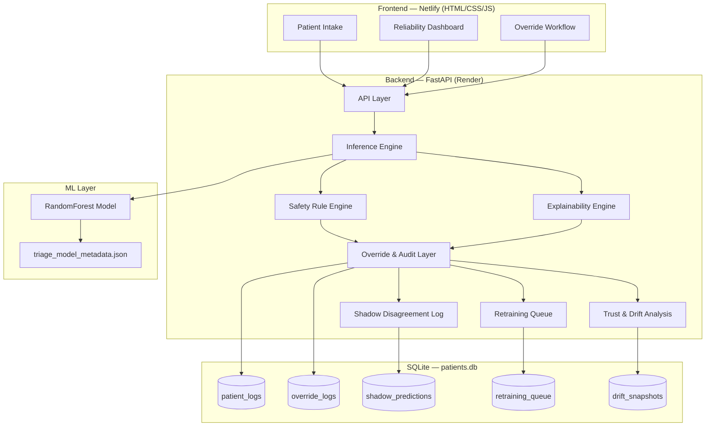

---

## Prediction Workflow

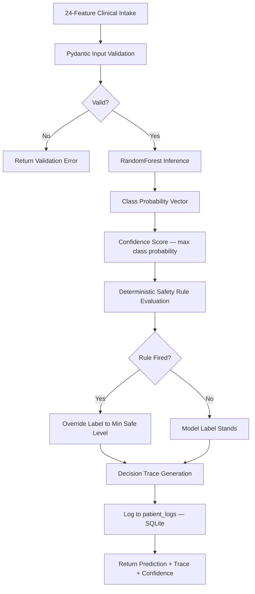

---

## Override Governance Workflow

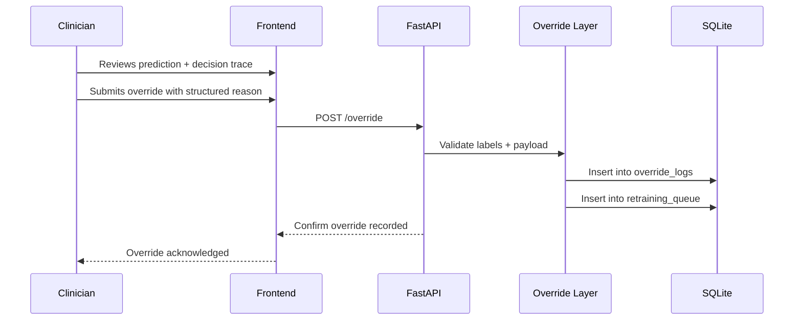

---

## Drift Analysis Workflow

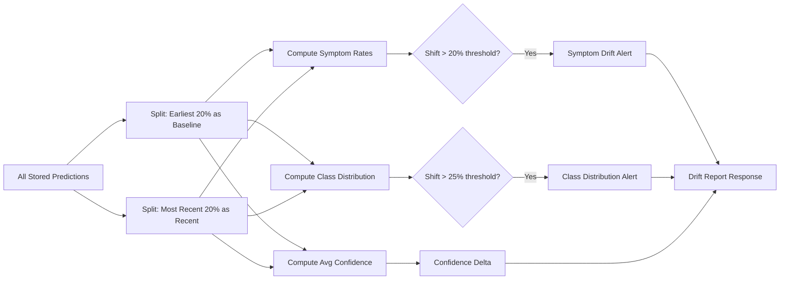

---

## Retraining Feedback Loop

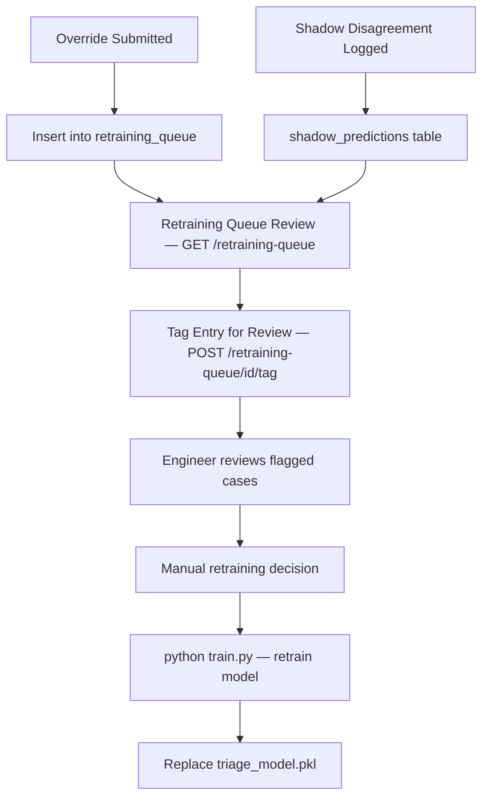

---

## Tech Stack

| Layer | Technology |
|-------|-----------|
| Frontend | HTML, CSS, Vanilla JavaScript |
| Backend | FastAPI (Python 3.11) |
| ML Model | scikit-learn RandomForest |
| Model Artifact | `triage_model.pkl` + `triage_model_metadata.json` |
| Database | SQLite (`patients.db`) |
| LLM (local only) | TinyLlama via Ollama |
| Frontend Hosting | Netlify |
| Backend Hosting | Render |

---

## Dataset & Model

| Property | Detail |
|----------|--------|
| Dataset | Synthea synthetic EHR (`synthea_csv_ehr_expanded`) |
| Records | 61,459 rows |
| Features | 24 structured clinical inputs |
| Target classes | Low, Medium, High, Critical |
| Model | scikit-learn RandomForestClassifier (350 estimators, max_depth=14, balanced_subsample) |
| Benchmark accuracy | 82.43% on held-out synthetic data |
| Label derivation | Heuristic risk scoring from vitals, symptoms, comorbidities, and encounter class |
| PHI | None — fully synthetic, no real patient data |

**On the accuracy figure:** 82.43% is measured against labels derived from a heuristic risk-scoring function applied to Synthea synthetic EHR records — not from real physician triage decisions. It confirms the model learns the heuristic signal on synthetic data. It does not represent clinical performance on real patient populations and should not be interpreted as clinical validation.

---

## API Reference

All routes are documented interactively at [/docs](https://triageflow-ai-ooy4.onrender.com/docs). The table below reflects the exact routes implemented in `app.py`.

| Method | Endpoint | Description |
|--------|----------|-------------|
| `GET` | `/` | System health check and version info |
| `POST` | `/predict` | Submit 24-feature patient intake; returns prediction, confidence, and decision trace |
| `POST` | `/chat` | Conversational intake via TinyLlama (local dev only; requires Ollama) |
| `GET` | `/logs` | Last 50 prediction logs with decision traces |
| `GET` | `/audit-log` | Alias for `/logs` |
| `POST` | `/override` | Submit physician override (also accepts `/override-submit`) |
| `GET` | `/override-logs` | Last 50 override log entries |
| `GET` | `/override-analytics` | Override rate, direction, symptom breakdown, and insight |
| `GET` | `/model-evaluation` | Prediction distribution, confidence stats, override analytics |
| `GET` | `/trust-metrics` | Trust score, agreement rate, reliability index |
| `GET` | `/trust-score` | Alias for `/trust-metrics` |
| `GET` | `/reliability-dashboard` | Combined trust metrics + model evaluation |
| `GET` | `/reliability-alerts` | Active governance alerts (override rate, high-confidence overrides, trust score) |
| `GET` | `/decision-trace/{patient_log_id}` | Decision trace for a specific logged prediction |
| `GET` | `/drift-report` | Prototype drift analysis: symptom rates, class distribution, confidence delta |
| `GET` | `/drift-metrics` | Alias for `/drift-report` |
| `POST` | `/shadow` | Log a clinician vs. AI disagreement for a given prediction |
| `GET` | `/shadow-stats` | Agreement rate and disagreement count across shadow log |
| `GET` | `/retraining-queue` | Retrieve retraining queue entries with override context |
| `POST` | `/retraining-queue/{entry_id}/tag` | Tag a retraining queue entry for review |

---

## Local Setup

### Backend

```bash
git clone https://github.com/JeeniaBasu/TriageFlow-AI.git
cd TriageFlow-AI/backend

pip install -r requirements.txt

# Train the model (required before running the server)
python train.py

# Start the API server
uvicorn app:app --reload --port 8000
```

API available at `http://localhost:8000`  
Swagger docs at `http://localhost:8000/docs`

### Frontend

```bash
cd ../frontend

# Option 1: Python static server
python -m http.server 5500

# Option 2: VS Code Live Server extension
# Open index.html and click "Go Live"
```

### Ollama (Local Conversational Intake)

```bash
# Install Ollama
curl -fsSL https://ollama.ai/install.sh | sh

# Pull TinyLlama
ollama pull tinyllama

# Start Ollama
ollama serve
```

The `/chat` endpoint will be active when Ollama is running locally. It is not available in the hosted Render deployment.

---

## Deployment

**Frontend** is deployed to [Netlify](https://netlify.com) via continuous deployment from the `frontend/` directory.

**Backend** is deployed to [Render](https://render.com) using:

```
uvicorn app:app --host 0.0.0.0 --port $PORT
```

Render's free tier spins down instances after inactivity — the first request after idle may take 30–60 seconds.

**Database** uses SQLite (`patients.db`) persisted on Render's ephemeral filesystem. Data does not survive redeployments on the free tier.

---

## Screenshots & Demo

### Live Triage Intake
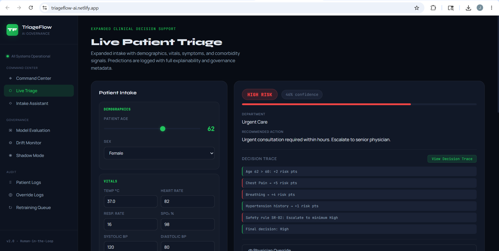

### Decision Trace
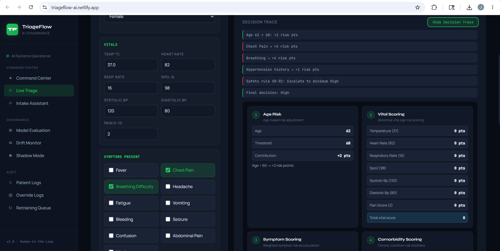

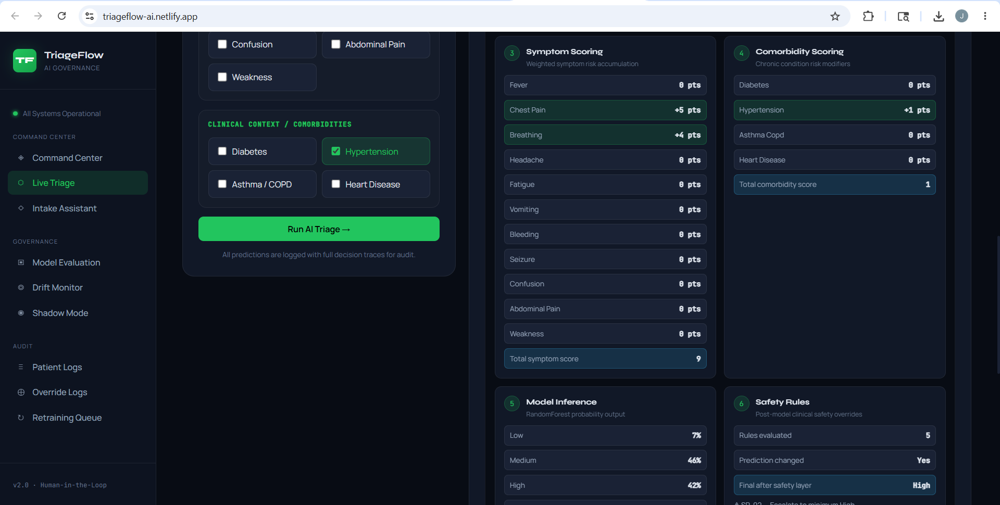

### Physician Override Workflow
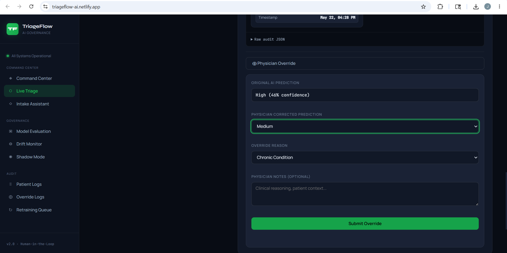

### Reliability Dashboard
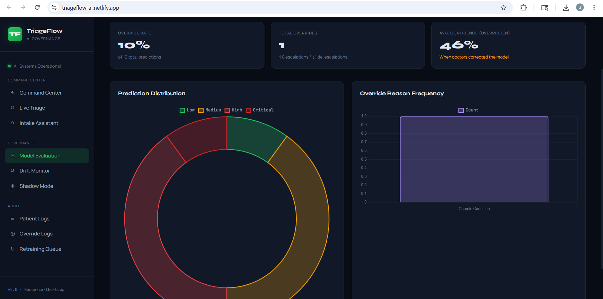

### Drift Analysis
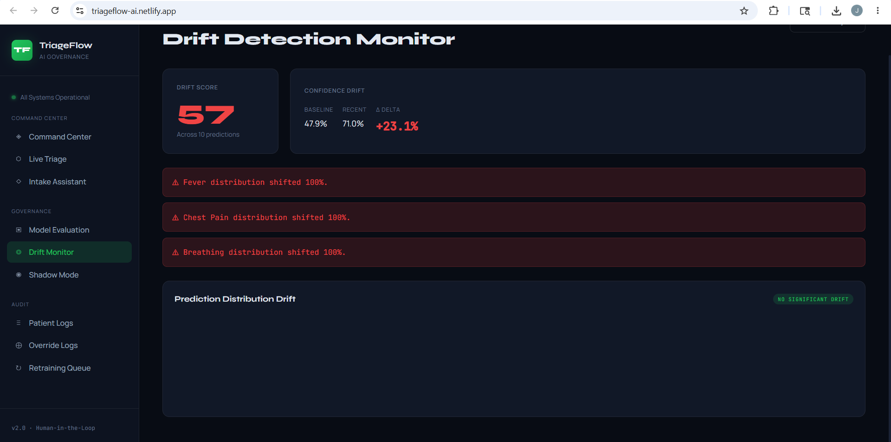

## Live Demo

🌐 Frontend Demo: https://triageflow-ai.netlify.app/

⚙️ Backend API Docs: https://triageflow-ai-ooy4.onrender.com/docs

🎥 Full Product Walkthrough Video:
https://drive.google.com/file/d/1Kmf-dxqT9tq4_4SLRI4RoOXnWqBUWDuV/view?usp=drive_link

---

## Prototype Scope

TriageFlow AI is a research and demonstration prototype built entirely on synthetic data.

- **No PHI.** All data is Synthea-generated synthetic EHR records. No real patient information was used at any stage.
- **Not clinically validated.** The model has not been evaluated against real patient populations or clinical outcomes.
- **Research and demonstration use only.** Intended for engineering exploration and governance pattern demonstration, not clinical deployment.
- **SQLite persistence.** Appropriate for prototyping; not designed for concurrent production workloads.
- **Prototype scope.** This project demonstrates governance architecture patterns for healthcare AI — not a production medical device.

---

## Why This Matters for Healthtech Teams

Building a triage classifier addresses a narrow problem. Deploying it responsibly requires solving a broader set of infrastructure problems that most ML projects never reach:

- **Explainability** — Can a clinician understand and validate the prediction before acting on it?
- **Override governance** — Is there a structured, auditable pathway for clinicians to correct errors?
- **Observability** — Can engineers detect when model behaviour is shifting before it causes harm?
- **Auditability** — Is every prediction and every correction logged with enough context to reconstruct what happened?
- **Feedback loops** — Is there a mechanism to capture corrections and surface them for retraining decisions?

TriageFlow AI is an end-to-end prototype built around these questions. It demonstrates the engineering thinking required to move healthcare AI from research into trustworthy, governable systems — which is the harder and more important problem.

---

## Contact

**Jeenia Basu**  
GitHub: [github.com/JeeniaBasu](https://github.com/JeeniaBasu)  
Live Project: [triageflow-ai.netlify.app](https://triageflow-ai.netlify.app/)
